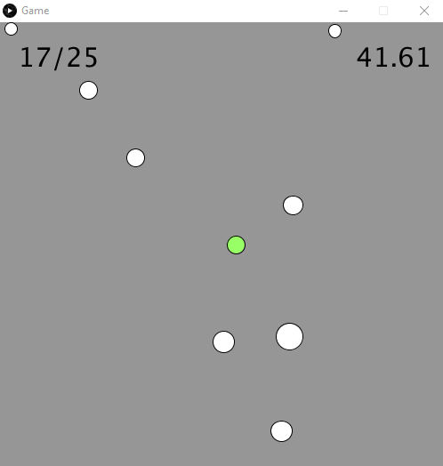
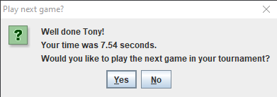
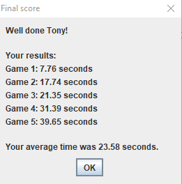
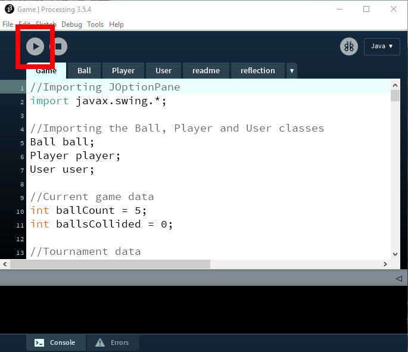

# Colliding Ball Game

A Java game developed and run in Processing.

- Aim: to collide with all of the balls in the shortest time possible.
- The speed of the balls and ball count increases after every game



The player enters their name and the number of games they wish to play at the beginning.


The player's time for each game is recorded and displayed at the end of each game.



The player's final results are displayed at the end of their games.




### Technologies

- Java
- [Processing](https://processing.org/)


### Usage

```
# Clone the repository:
$ git clone https://github.com/TonyN96/colliding-ball-game.git
```

Open `Game.pde` in Processing and Run the file

